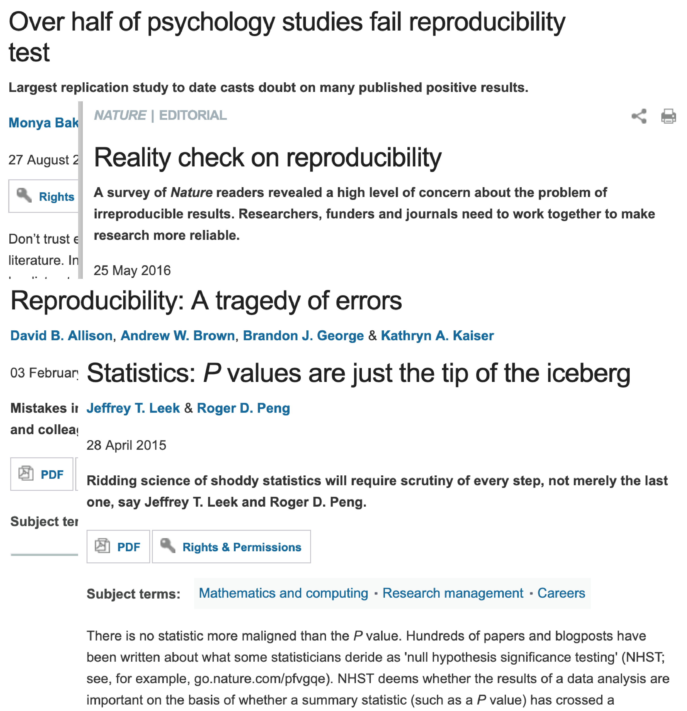

Reproducible Research in R
========================================================
author: Adele Barugahare
date: 23/07/2019
autosize: true

Today's Objectives
========================================================

* use knitr, rmarkdown and bookdown R packages to build various document types including PDF, HTML and DOCX
* work with git version control tool
* create reproducible and “backed up” analysis via remote repositories (e.g github)

What We Aren't Learning:

* R itself

Reproducibility Crisis
========================================================
incremental: true

- 

Why Use R
========================================================

- It's free legally & continous active development
- Low risk of inadvertent data loss/mutation.
  * By design, R requires you to load your data in, what you do with the data is then written in code (R language)
- Collaborative: share your data and analysis

Why Use R
========================================================

[Well developed ecosystem](https://www.rstudio.com/products/rpackages/) of software packages that expands base R for data analysis, project management, visualisation, document generation, etc

***

Reproducible Analysis with R
========================================================

* Document what you've done with your data in code
* Maintain software versions used for the analysis 
* Track changes to your analysis with version control

Reproducible Analysis with R
========================================================

